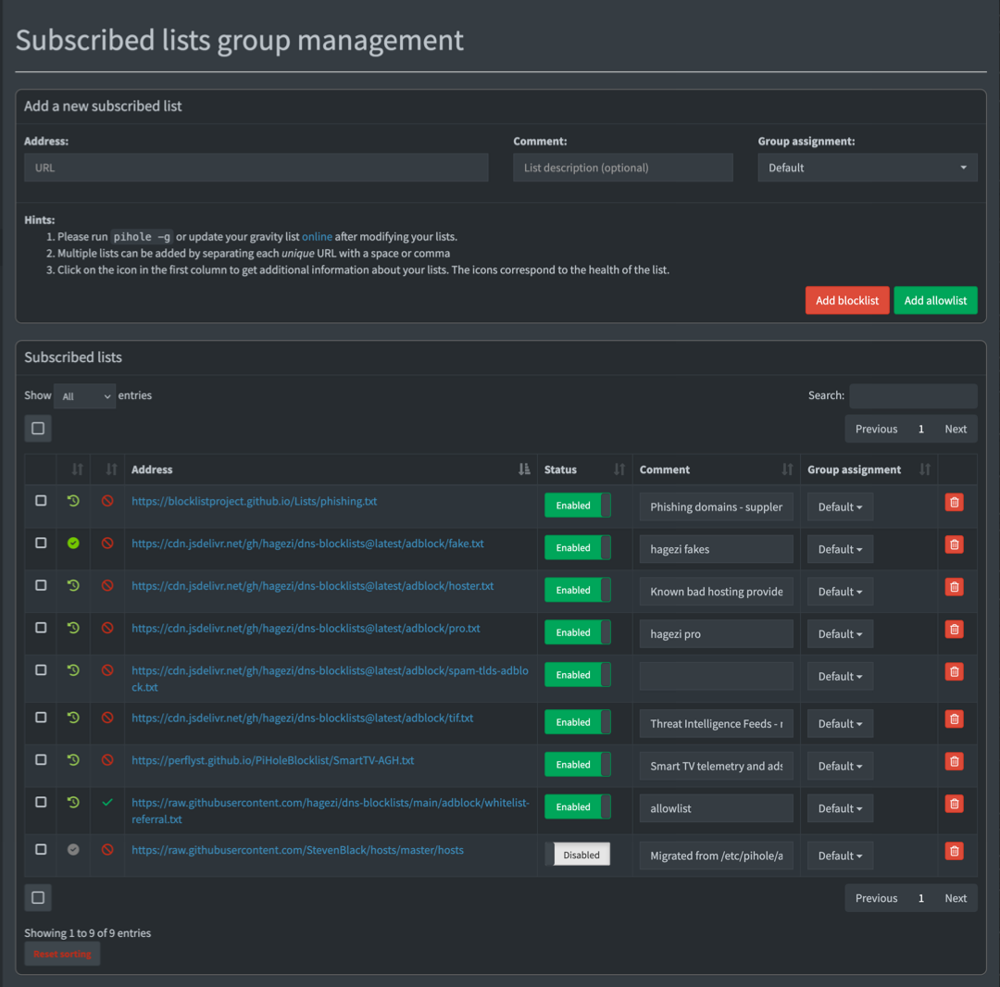

import { Steps } from '@astrojs/starlight/components';

Pi-hole v6 manages blocklists and allowlists natively through the web interface or command line.



Blocklists tell Pi-hole which domains to block.
Allowlists tell it which ones to always let through, even if they match an entry on the blocklist.

A bigger blocklist isn't necessarily better and can cause issues for day-to-day browsing or streaming.
Many services depend on domains that look like tracking but are required to work.

Most streaming apps run a verification chain on launch: they contact telemetry or analytics domains, and if those fail, the streaming app refuses to play content.
This can be frustrating and has led to a number of "why isn't the TV working" complaints in my house.

If you're just here to add lists, you can skip to the section:
- [Add Blocklists to Pi-hole](#add-blocklists-to-pi-hole)
- [Add Allowlists and Domains to Pi-hole](#add-allowlists-and-domains-to-pi-hole)

## How to Choose the Best Pi-hole Blocklist

The two most-recommended Pi-hole blocklists are [HaGeZi](https://github.com/hagezi/dns-blocklists) and [OISD](https://oisd.nl/).
Both are well-maintained, low-false-positive options.

The difference is how much control you want:

**OISD Big** is a single URL, maintained by one person, optimized for zero breakage.
If you want to set it and never think about it again, use `https://big.oisd.nl/`.

**HaGeZi** aggregates dozens of upstream sources including OISD, StevenBlack, EasyList, EasyPrivacy, URLHaus, and PhishTank into tiered lists you can dial up or down.
At the Normal tier it's comparable to OISD Big.
At Pro and above it blocks significantly more, and OISD is still included as an upstream source.
HaGeZi also offers supplementary category lists (threat intelligence, spam TLDs, smart TV telemetry) that don't have OISD equivalents.

This guide uses HaGeZi because the tiered approach gives a clear choice between "fewest possible issues" and "maximum blocking," and the supplementary lists add coverage that a single all-in-one list can't match.

Most of the setup in this guide relies on one maintainer.

Six of the lists below come from HaGeZi.
If the project goes inactive, the supplementary lists (Perflyst Smart-TV, BLP Phishing) will keep working, but the core blocklist won't update.
[OISD Big](https://oisd.nl/) is a natural, and still excellent, fallback.

:::note[Blocklists/Allowlists and Blacklists/Whitelists]
As of Pi-hole v6, Pi-hole uses the words `blocklist` and `allowlist` instead of the legacy `whitelist` and `blacklist`.

Some list maintainers still use some of the outdated languages in their descriptions and in the list URLs.
:::

### Choose a HaGeZi tier

- **HaGeZi Normal**
  - Balanced blocking with minimal false positives.
    Good for environments where there's no admin nearby to unblock something.

- **HaGeZi Pro**
  - Good coverage, manageable breakage (this guide uses this)
    More aggressive than "Normal," but still reasonable for daily use.

    Occasionally blocks something legitimate.
    Check the query log when something breaks.

- **HaGeZi Pro++**
  - HaGeZi recommends this for experienced users with an admin available to troubleshoot.

For quick reference, the full tier progression is: Light > Normal > Pro > Pro++ > Ultimate.
See [HaGeZi's README](https://github.com/hagezi/dns-blocklists) for descriptions of each.

### Recommended blocklists

If you enabled the default blocklist or previously used [The Firebog](https://firebog.net/), [StevenBlack/hosts](https://github.com/StevenBlack/hosts), or [1Hosts](https://github.com/badmojr/1Hosts), you can disable them in favor of the lists on this page.

HaGeZi already includes these as upstream sources.
They can create duplicate entries without providing additional coverage.
Pi-hole deduplicates during Gravity updates so it won't break anything, but it's unnecessary weight.

<Steps>

1. Choose one core HaGeZi list:

   - HaGeZi Normal

     ```url
     https://cdn.jsdelivr.net/gh/hagezi/dns-blocklists@latest/adblock/multi.txt
     ```

   - HaGeZi Pro (recommended)

     ```url
     https://cdn.jsdelivr.net/gh/hagezi/dns-blocklists@latest/adblock/pro.txt
     ```

   - HaGeZi Pro++

     ```url
     https://cdn.jsdelivr.net/gh/hagezi/dns-blocklists@latest/adblock/pro.plus.txt
     ```

1. Optional: Choose any supplementary lists (use with either tier):

   - HaGeZi TIF

     Threat Intelligence Feeds - malware, phishing, cryptojacking

     ```url
     https://cdn.jsdelivr.net/gh/hagezi/dns-blocklists@latest/adblock/tif.txt
     ```

   - HaGeZi Bad Hoster

     Known bad hosting providers

     ```url
     https://cdn.jsdelivr.net/gh/hagezi/dns-blocklists@latest/adblock/hoster.txt
     ```

   - HaGeZi Anti-Piracy

     Piracy-related domains

     ```url
     https://cdn.jsdelivr.net/gh/hagezi/dns-blocklists@latest/adblock/anti.piracy.txt
     ```

   - HaGeZi Spam TLDs

     Entire TLDs with no legitimate traffic

     ```url
     https://cdn.jsdelivr.net/gh/hagezi/dns-blocklists@latest/adblock/spam-tlds-adblock.txt
     ```

   - Smart-TV Blocklist

     Smart TV telemetry and ads

     ```url
     https://perflyst.github.io/PiHoleBlocklist/SmartTV-AGH.txt
     ```

   - BLP Phishing

     Phishing domains - supplements HaGeZi TIF

     ```url
     https://blocklistproject.github.io/Lists/phishing.txt
     ```

</Steps>

## Add Blocklists to Pi-hole

To add a list:

<Steps>

1. Log in to the Pi-hole web interface at `https://pi-hole.local/admin`.
1. Go to **Lists**.
1. Paste a list URL, then select **Add blocklist**.
1. After you add all the lists, update the Pi-hole's list settings (what it calls "Gravity") in **Tools** > **Update Gravity** to apply them, or use the CLI:

   ```shell title="From the Pi"
   pihole -g
   ```

   Gravity also runs automatically on a weekly schedule.

</Steps>

## Add Allowlists and Domains to Pi-hole

There are two ways to allowlist in Pi-hole v6:

- **List subscriptions:** Subscribe to a URL and Pi-hole manages it automatically, like a blocklist.
  Best for maintained collections of domains.
- **Individual domain entries:** Add a single domain directly in **Domains** > **Allowlist** in the web interface.
  Best for one-off fixes when a specific service breaks.

### Subscribe to a referral allowlist

The HaGeZi Referral Allowlist is a maintained collection of domains that blocklists commonly block but that services legitimately need.
Adding it as a subscription prevents a large category of false positives before they happen.

<Steps>

1. In the Pi-hole web interface, go to **Lists**.
1. Paste the allowlist:

   ```url
   https://raw.githubusercontent.com/hagezi/dns-blocklists/main/adblock/whitelist-referral.txt
   ```

1. Select **Add allowlist**
1. After you add all the lists, update Gravity in **Tools** > **Update Gravity** to apply them, or use the CLI:

   ```shell title="From the Pi"
   pihole -g
   ```

   Gravity also runs automatically on a weekly schedule.

</Steps>

### Add an Individual Domain to the Allowlist

You can instruct Pi-hole to allow individual domains.

This is different from the lists we added in previous sections.

If you encounter an error with a website or service, check the query log at `https://pi-hole.local/admin/queries`.
Select **Advanced filtering** to filter by client or domain and sort by time.
After you find the domain, select **Allow** to add the domain to the allowlist.

See [Troubleshoot a Broken Service](./troubleshooting/#troubleshoot-a-broken-service) for tips.

### Fix Streaming Services and Other Broken Sites

If a service stops working after you set up Pi-hole, the likely cause is a blocked domain.
The sections below list known fixes for common services.

You can use the Pi-hole dashboard to add multiple domains one at a time through the **Domains** section at `https://pi-hole.local/admin/groups/domains`.

The CLI allows you to add multiple domains in the same command.
For each service in the sections below, you can copy the domains from the table into the dashboard, or run the `pihole allowlist` command.

Run the command for the services you use, then run `pihole -g` to apply the changes.

Note that domains can change.
Streaming services update their CDN and analytics infrastructure regularly.
If a service breaks again after you've already allowlisted it, check the query log for newly blocked domains.

#### Disney+

```shell title="From the Pi"
pihole allowlist geolocation.onetrust.com registerdisney.go.com global.edge.bamgrid.com disney.demdex.net
```

| Domain                     | Why it's needed |
|----------------------------|-----------------|
| `geolocation.onetrust.com` | Geolocation and rights verification - checked on launch |
| `registerdisney.go.com`    | Authentication - needed at sign-in and on app launch |
| `global.edge.bamgrid.com`  | Core streaming CDN |
| `disney.demdex.net`        | Audience/identity service - blocks cause content to fail to load |

#### Hulu

Required for ad-supported plans.

On Hulu's ad-supported plan, ad-serving domains share infrastructure with content delivery.
Blocking ads breaks playback entirely.

There is no domain you can allowlist to effectively block the ads.
Sorry.

```shell title="From the Pi"
pihole allowlist geolocation.onetrust.com
```

| Domain                     | Why it's needed |
|----------------------------|-----------------|
| `geolocation.onetrust.com` | Same geolocation check as Disney+ |

#### Paramount+

Paramount+ uses Google's Dynamic Ad Insertion, which means fixing it requires allowlisting Google ad infrastructure domains (which defeats the purpose of Pi-hole).

The better fix is to put the Paramount+ device in a bypass group so it skips filtering entirely.
See [Skip Pi-hole for a Specific Device](#skip-pi-hole-for-a-specific-device) below.

#### YouTube

Pi-hole cannot effectively block YouTube video ads.

Google serves ads and content from the same domains and there is no DNS-level way to separate them.
Pi-hole can block some banner ads on the YouTube website, but pre-roll and mid-roll video ads are unaffected.
This is a fundamental limitation of DNS-based blocking, not a configuration problem.

For YouTube in the browser, an extension like [uBlock Origin](https://github.com/gorhill/uBlock?tab=readme-ov-file#ublock-origin-ubo) can be more successful.

#### Netflix, Max, Apple TV+

These services generally work without individual domain allowlisting.
If thumbnails fail to load or playback fails, check the query log for blocked CDN domains and allowlist as needed.

#### Samsung Smart TVs

These domains are required for the Smart Hub, app downloads, and basic platform functionality.
Blocking them can break the entire app ecosystem, not just one service.

```shell title="From the Pi"
pihole allowlist samsungcloudsolution.com lcprd1.samsungcloudsolution.net time.samsungcloudsolution.com
```

| Domain                            | Why it's needed |
|-----------------------------------|-----------------|
| `samsungcloudsolution.com`        | Smart Hub core service |
| `lcprd1.samsungcloudsolution.net` | CDN for Smart Hub content |
| `time.samsungcloudsolution.com`   | Platform time sync |

#### Amazon Fire TV / Fire Stick

```shell title="From the Pi"
pihole allowlist fireoscaptiveportal.com dp-discovery-na-ext.amazon.com
```

| Domain                           | Why it's needed |
|----------------------------------|-----------------|
| `fireoscaptiveportal.com`        | Network connectivity check - blocks cause "no internet" errors |
| `dp-discovery-na-ext.amazon.com` | App discovery and store |

#### Roku

Roku devices are sensitive to blocked telemetry domains and apps might load but show no thumbnails, or video won't play.
Specific blocked domains vary by region and Roku model.
Use the query log method to identify what your device requests.

## Control Blocking Per Device with Groups

By default, every device on your network is part of the same `Default` group and follows that group's rules.
Pi-hole's group system lets you change that per device so that you can assign a group to skip blocking entirely for problem devices, or to apply stricter rules for a specific device like a child's laptop.

All blocklists are assigned to the `Default` group, and every device is in that group unless you change it.

A device can be added to multiple groups at the same time and will follow the combined rules of all its groups.

### Skip Pi-hole for a Specific Device

Useful for a device where blocking breaks functionality and you can't or would rather not troubleshoot it (smart TVs, streaming sticks, Paramount+, Roku).

<Steps>

1. Find the device's IP address in **Tools** > **Network** or based on its traffic in the **Query Log**.

1. Go to **Groups** and add a new group.
   Name it something like `skip` or `unfiltered`.

1. Go to **Clients** and search for or select the device from the **Known clients** dropdown.

1. Under **Group assignment**, uncheck `Default` and select your new group.

1. Select **Add**.

</Steps>

The device now resolves DNS without any filtering.
All other devices are unaffected.

### Block YouTube and Social Media for a Specific Device

Apply extra blocklists on top of the normal ones without affecting the rest of the network.
This can be useful for a child's device or a school-issued laptop.

<Steps>

1. Confirm that the device's network traffic isn't being routed through a VPN.

   You can do this by [checking the IP](https://whatismyip.org/) on one of your other devices and on the device you want to restrict.

   - If the IPs are the same, continue to the next step.
   - If the IPs are different, the device is probably directing traffic through a VPN and these steps won't work.

1. Go to **Groups** and add a new group.
   Name it something like `kids` or `restricted`.

1. Go to **Lists** and [add the lists](#add-blocklists-to-pi-hole) you want to apply to this group.

1. Under **Group assignment**, unselect `Default` and select the new group.

   Recommended lists for parental filtering (all from [HaGeZi](https://github.com/hagezi/dns-blocklists)):

   | What it blocks                                           | URL |
   |----------------------------------------------------------|-----|
   | Social media (Facebook, Instagram, TikTok, X, Snapchat)  | `https://cdn.jsdelivr.net/gh/hagezi/dns-blocklists@latest/adblock/social.txt` |
   | NSFW and adult content                                   | `https://cdn.jsdelivr.net/gh/hagezi/dns-blocklists@latest/adblock/nsfw.txt` |
   | DoH/VPN/TOR bypass (prevents tunneling out of filtering) | `https://cdn.jsdelivr.net/gh/hagezi/dns-blocklists@latest/adblock/doh-vpn-proxy-bypass.txt` |

   :::note
   Blocking YouTube via DNS is all-or-nothing - there's no way to allow educational content while blocking everything else.
   If your goal is "no YouTube at all," add `youtube.com` as a domain to the group's blocklist.
   If your goal is "safe YouTube," DNS isn't the right tool - use YouTube's built-in parental controls or a browser extension instead.
   :::

1. Go to **Clients** and add the device.

1. Under **Group assignment**, keep `Default` and add the new group.

1. Select **Add**.

</Steps>

The device is now blocked by everything in `Default` as well as the extra lists.
Other devices that are not in the new group are unaffected.

:::note
MAC address recognition only works for devices on the same router hop as the Pi-hole.
For devices behind a second router or managed switch, use the IP address instead.
If the router assigns IPs dynamically, assign a static DHCP lease for that device in your router settings, or the IP may change after a reboot.
:::

## Checkpoint

Pi-hole is now blocking ads across your network with a curated list configuration:

- Gravity shows a domain count in the dashboard (run `pihole -g` if it's empty)
- Streaming services load without issues, or you've identified which devices need a bypass group
- Any problem devices are in a skip group, and any restricted devices are in a group with extra lists
- If you run into issues, see [Common Pi-hole Issues](./troubleshooting/#blocklists-and-allowlists).

The next page covers configuring your router so every device on the network uses Pi-hole for DNS automatically.
