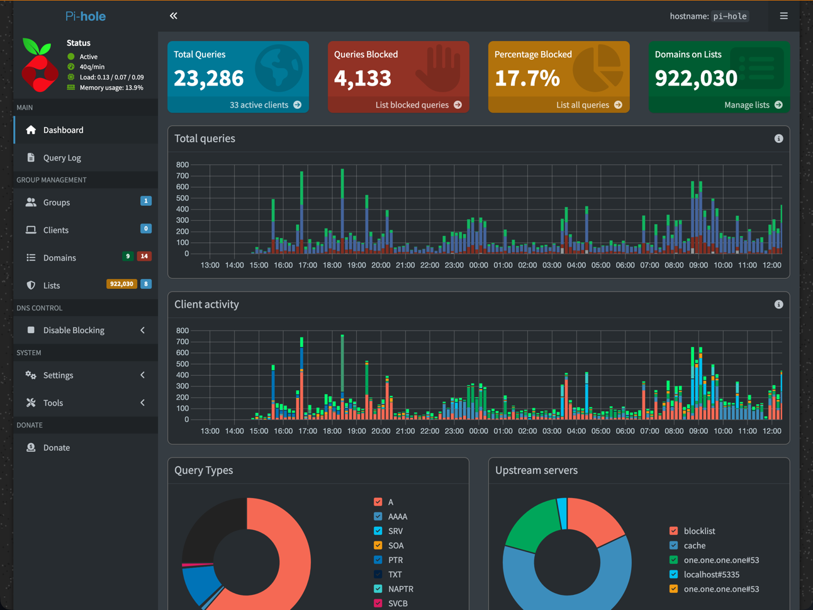

Pi-hole is a DNS-based ad blocker for your whole network.

A basic way to understand it is:
When a device on your network tries to access something from the Internet, it checks in with the Pi-hole first.
The Pi-hole checks the address of what the device is looking for against a list you've configured the Pi-hole with, and if that resource isn't on the list, it allows the device to connect to it.

Usually, the website itself still loads while the ads and trackers get blocked.

Due to some hardware issues in the past, I've had to rebuild this setup several times, collecting steps from around the Internet each time.
This guide is a collection of my notes, organized into documentation to help other people set up or rebuild their Pi-hole.

The steps in this guide document how I set up Pi-hole v6 with:

- Raspberry Pi 4 running Raspberry Pi OS (Bookworm)
- UFW firewall
- [HaGeZi tiered blocklists](https://github.com/hagezi/dns-blocklists) with supplementary category lists
- Allowlists for streaming and smart TV platforms
- Omada controller DHCP configured for network-wide blocking
- Teleporter backup for configuration export/restore
- Optional:
  - [Unbound](https://docs.pi-hole.net/guides/dns/unbound/) recursive DNS with Cloudflare as fallback
  - [Netdata](https://www.netdata.cloud/) system and Pi-hole monitoring
  - [Tailscale](https://tailscale.com/) for remote admin access and to make the Pi-hole act as a personal VPN
  - More restrictive [groups for specific devices](./block-allow-lists#block-youtube-and-social-media-for-a-specific-device)

This doc is a copy-and-paste solution for my specific hardware and preferences.
Visit [the official Pi-hole documentation](https://docs.pi-hole.net/) for other use cases and details.

This guide is written for Pi-hole v6.
If you have Pi-hole v5 installed, many of the concepts remain the same in v6.
You can still access the [older version of this guide on GitHub](https://github.com/EdwardAngert/edwardangert.github.io/blob/551b9d08bb444c42ed2b56dcbc928105984da7bd/src/content/docs/pi-hole/index.mdx).

If you identify any errors or areas for improvement, please [submit a GitHub issue](https://github.com/EdwardAngert/edwardangert.github.io/issues/new).

## Prerequisites

- Access to your router's configuration.
  - This is required if you want devices on your network to use the Pi-hole.
  - Some routers have a sticker with their admin information.
    You can also try [some common router IPs](https://www.techspot.com/guides/287-default-router-ip-addresses/) like `192.168.1.1`.

    This is usually your gateway IP.
- [Raspberry Pi](https://www.raspberrypi.com)
- microSD card, 8 GB or larger, with a way to plug it into your computer.
- Familiarity with a terminal and the command line, or at least comfort following terminal commands.
  Most commands in this guide can be copied and pasted, and I try to explain the ones that can't be.

### Before You Begin

The [Add Blocklists and Allowlists](./block-allow-lists/) page covers a curated set of community-maintained lists, including options for advertisements, malware, phishing, social media, gambling, and NSFW content.
Pi-hole is great at blocking domains like these.

A few limitations to consider before you start:

Pi-hole works at the DNS level.
It sees (and can log) the domain name but not the URL or content.
That means it can't distinguish between types of content on the same domain.
Something like `youtube.com` is either blocked entirely or not at all because Pi-hole can't tell the difference between kids content and anything else.

Some streaming services also serve ads through the same domains as their content.
Pi-hole cannot block Hulu or Disney+ ads on their ad-supported plans without breaking the service.

For most other services, you can [add service-specific rules to the allowlists](./block-allow-lists/#fix-streaming-services-and-other-broken-sites) when you get to that page, or skip ahead if that's your main Pi-hole use case.

## In This Guide

- [Set Up Raspberry Pi OS](./install-configure/)
  - Flash the SD card, harden the OS with UFW and Fail2Ban, set a static IP.
- [Install Pi-hole v6](./pihole-install/)
  - Run the installer, set a password, optional unbound and Netdata, troubleshooting.
- [Add Blocklists and Allowlists](./block-allow-lists/)
  - Choose a blocklist tier, add supplementary lists, allowlist streaming services and smart TVs, and use groups to control blocking per device - including bypassing Pi-hole for a specific device or applying stricter rules for a child's device.
- [Enable Network-wide DNS Blocking with Pi-hole](./network-level-blocking/)
  - Configure router DHCP so every device uses Pi-hole for DNS.
- [Use Pi-hole as a VPN to Block Ads On the Go with Tailscale](./tailscale/)
  - Block ads on your phone and laptop anywhere, remote admin access, no port forwarding required.
- [Pi-hole Maintenance and Advanced Configuration](./maintenance/)
  - Update Pi-hole, export/import backups with Teleporter, tune `pihole.toml`, offload logs to a USB drive.
- [Troubleshooting](./troubleshooting/)
  - Fix common installation issues, DNS failures, broken streaming services, Gravity errors, and Tailscale DNS problems.
