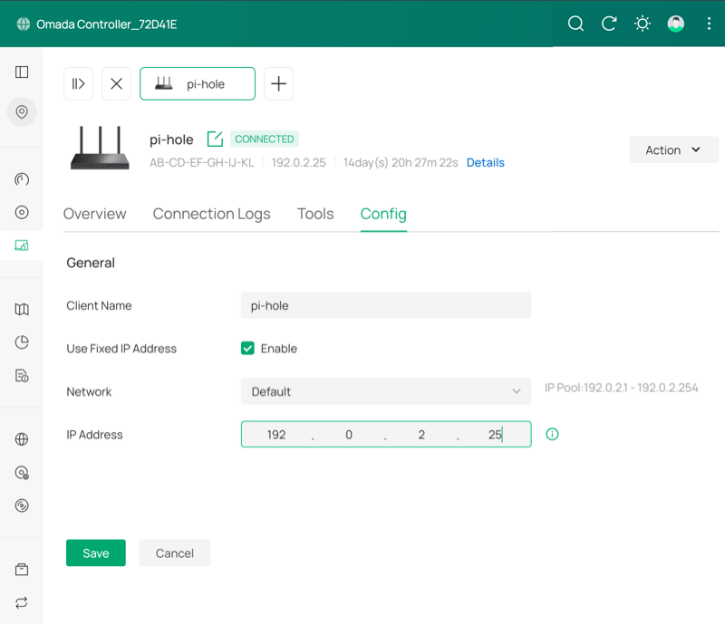

import { Steps } from '@astrojs/starlight/components';
import { Tabs, TabItem } from '@astrojs/starlight/components';
import Verified from '../../../components/Verified.astro';

<Verified date="2026-08" method="tested" />

## Install Software Locally

The tools below are linked to their official download pages.

macOS users can install tools both using [Homebrew](https://brew.sh/).
Windows and Linux users can download installers directly from each link.

- [SD Card Formatter](https://www.sdcard.org/downloads/formatter/)
- [Raspberry Pi Imager](https://www.raspberrypi.com/software/)

For macOS users with Homebrew:

```shell title="From your Mac"
brew install sdformatter raspberry-pi-imager
```

## Format the SD Card

:::caution
This process erases everything on the SD card.
:::

<Steps>

1. Insert a microSD card, then open SD Card Formatter and choose the card from the **Select card** dropdown.
1. Select **Format** to format the card.
   - The default settings are fine: Quick format and no volume label.
1. Exit SD Card Formatter and leave the SD card inserted.

</Steps>

## Create the Pi OS Image on the SD Card

Raspberry Pi Imager makes the SD card a bootable drive.
After you set up the SD card, you'll install it in the Raspberry Pi as its primary drive.

<Steps>

1. Open Raspberry Pi Imager.
1. **Select your Raspberry Pi Device**: Raspberry Pi 4 (select your own board if it's different).
1. **Choose operating system**: Raspberry Pi OS (64-bit).
1. **Select your storage device**: Select the SD card.
1. **Customisation: Choose hostname**: `pi-hole`.
1. **Customisation: Localisation**: Select your location and time zone.
   - My selections:
     - Capital city: `Washington, D.C. (United States)`
     - Time zone: `America/New_York`
     - Keyboard layout: `us`
1. **Customisation: Choose username**: Create a user account.
   - The examples in this guide use the username `pi-admin`.
1. **Customisation: Choose Wi-Fi** to configure the wireless network connection.
   - Select **Next** if you will connect using Ethernet.
1. **Customisation: SSH authentication**: Enable SSH and select **Use password authentication**.
   - Optionally, [use public key authentication](https://www.raspberrypi.com/documentation/computers/remote-access.html#configure-ssh-without-a-password) for more secure access.

     <details>
     <summary>Set up a key instead of a password</summary>

     Imager lets you paste a public key directly into this screen, so you don't need a separate setup step on the Pi.

     1. Check whether you already have a key on this device:

        ```shell title="From your device"
        ls ~/.ssh/id_ed25519.pub
        ```

     1. If that file doesn't exist, generate one:

        ```shell title="From your device"
        ssh-keygen -t ed25519 -C "pi-hole"
        ```

        Accept the default file location, then set a passphrase or leave it blank.

     1. Back in Imager, select **Allow public-key authentication only**, then **Add SSH key**, and paste in the contents of the `.pub` file (find it with `cat ~/.ssh/id_ed25519.pub`).

     This closes the gap between first boot and Fail2Ban's installation later in this guide, when password auth would otherwise be your only protection for SSH.

     </details>

1. **Raspberry Pi Connect**: select **Next** to skip it. This guide doesn't use it.
1. **Write image**: select **Write**.
1. In the popup, review the warning, then select **I understand, erase and write** to continue.
1. When the write completes, remove the SD card from your computer and insert it into the Raspberry Pi.
1. Plug in the Pi and give it a few minutes to boot.

</Steps>

<details>
<summary>Rebuilds and Upgrades: Confirm Your Linux Version</summary>

Pi-hole v6 needs Debian 11 (Bullseye) or later, since FTL requires glibc 2.28.

If you're on an existing Pi, use `cat /etc/os-release | grep PRETTY_NAME` to confirm the release version before you continue:

```shellsession title="From the Pi"
pi-admin@pi-hole:~ $ cat /etc/os-release | grep PRETTY_NAME
PRETTY_NAME="Debian GNU/Linux 13 (trixie)"
```

</details>

## Configure Raspberry Pi OS

<Steps>

1. Find the Pi's IP Address:

   <Tabs>
   <TabItem label="Mac/Linux">
   ```shell title="From your device"
   ping -c 3 pi-hole.local
   ```
   </TabItem>

   <TabItem label="Windows">
   ```shell title="From your device"
   ping -n 3 pi-hole.local
   ```

   Windows users: If `pi-hole.local` doesn't resolve when you try to SSH, try the `arp` command:

   ```shell title="From your device"
   arp -a
   ```

   Look for a recently added entry and try to SSH to it in the next step.
   Or search your router's documentation for something like "DHCP client list" to help find the Pi on your network.
   </TabItem>
   </Tabs>

   <details>
   <summary>Other ways to find the Pi's IP</summary>

     - **Check your router**
       - Look for a page that says "DHCP clients" or "connected devices."
     - **Scan the network**
       - Use `nmap -sn 192.168.1.0/24` (adjust the subnet for your network, `192.168.1.0` in this example).
   </details>

1. SSH into the Pi from your local terminal:

   ```shell title="From your device"
   ssh pi-admin@pi-hole.local
   ```

   You can also use the IP you find in step 1 instead of `pi-hole.local`.

1. Enter the password you set in Raspberry Pi Imager when prompted.

1. If you configured Wi-Fi and also plugged the Pi in via Ethernet, your Pi will have two IP addresses.

   To make it easier to [enable network-wide blocking](/docs/pi-hole/network-level-blocking/#set-up-network-wide-pi-hole-on-a-tp-link-omada-controller) later, identify the Pi's Ethernet IP address.

   Confirm the Ethernet IP address from inside the SSH session on the Pi:

   ```shell title="From the Pi"
   ip addr show eth0
   ```

   If you're running Wi-Fi only, use `ip addr show wlan0` instead, and use that address later on.

</Steps>

### TP-Link Omada-Specific Steps to Find and Fix the Pi's IP

<details>
<summary>Find the Pi and set a fixed IP on a TP-Link Omada controller</summary>

<Steps>

1. Log in and select the site's name.
1. Select **Clients** then **Wired** to filter the table of connected clients.
1. Select **pi-hole** in the **Client Name** column to open the **Details** sidebar.
1. Select **Manage Client** > **Config** and check **Enable** next to **Use Fixed IP Address**.
1. Select **Save**.

   You should still follow the steps in the [Set a Static IP](#set-a-static-ip-address) section when you get there.

</Steps>



</details>

### Require a Password for sudo Commands

The non-root user that Raspberry Pi Imager created may be able to run `sudo` commands without a password.

Raspberry Pi OS grants that through a file in `/etc/sudoers.d/` named after the account, such as `010_pi-admin-nopasswd`.
Remove the file so that sudo commands require authentication.

Raspberry Pi OS 6.2 (April 2026) stopped creating that file on new installs, so a current image may not have one.
The command below handles both cases.

<Steps>

1. Remove the configuration file if it exists:

   ```shell title="From the Pi"
   sudo sh -c 'rm -fv /etc/sudoers.d/*-nopasswd'
   ```

   The glob runs inside `sh -c` so that root expands it.
   `/etc/sudoers.d/` is readable only by root, so your own shell can't match the filename before `sudo` starts.

   A removed file is named in the output.
   No output means there was nothing to remove.

1. Confirm no passwordless rule survives anywhere else in the directory:

   ```shell title="From the Pi"
   sudo grep -rl NOPASSWD /etc/sudoers.d/
   ```

   This prints nothing when passwordless `sudo` is off.
   Any file it names still grants it, and you should read that file before removing it.

1. Log out of the SSH session, then log back in:

   ```shell
   exit
   ssh pi-admin@pi-hole.local
   ```

</Steps>

### Set Up a Firewall on Your Pi with UFW

UFW (Uncomplicated Firewall) restricts which ports are accessible on the Pi.
Pi-hole requires ports for DNS and the web interface.
SSH is allowed for remote administration.

<Steps>

1. Install UFW:

   ```shell title="From the Pi"
   sudo apt install -y ufw
   ```

1. Allow SSH immediately to avoid getting locked out later:

   ```shell title="From the Pi"
   sudo ufw allow OpenSSH
   ```

1. Set the defaults for incoming and outgoing connections:

   ```shell title="From the Pi"
   sudo ufw default deny incoming
   sudo ufw default allow outgoing
   ```

1. Add the following to `/etc/ufw/applications.d/pihole` to group the required ports into a single app profile rule.
   Remember to use `sudo` to edit files throughout this guide:

   ```ini title="/etc/ufw/applications.d/pihole"
   [Pi-hole]
   title=Pi-hole
   description=Pi-hole DNS and Web Interface
   ports=53/tcp|53/udp|80/tcp|443/tcp
   ```

   If you don't have a preferred terminal-based text editor, you can use `sudo nano /etc/ufw/applications.d/pihole`.
   That will create the file and open the nano editor so you can add the rule.

   To save and exit nano: <kbd>CTRL+X</kbd>, then <kbd>Y</kbd>, then <kbd>Enter</kbd>.

1. Allow the profile:

   ```shell title="From the Pi"
   sudo ufw allow Pi-hole
   ```

1. Enable UFW with the new configuration:

   ```shell title="From the Pi"
   sudo ufw enable
   ```

1. Verify the rules are active:

   ```shell title="From the Pi"
   sudo ufw status
   ```

</Steps>

The `Pi-hole` rule above isn't scoped to an interface, so it applies to whatever can route to the Pi, not just your LAN.
That's intentional: later, [Use Pi-hole DNS to Block Ads for All Devices on Your Tailnet](/docs/pi-hole/tailscale/#use-pi-hole-dns-to-block-ads-for-all-devices-on-your-tailnet) depends on the same ports being reachable from the Tailscale interface too.

<details>
<summary>If you plan to use Pi-hole as a DHCP server</summary>

Pi-hole as a DHCP server is not covered in this guide, but this seems to be an issue people encounter.

If you plan to use Pi-hole as a DHCP server, add another `ufw allow`:

```shell title="From the Pi"
sudo ufw allow 67/udp comment 'DHCP'
```

</details>

### Protect SSH with Fail2Ban

Fail2Ban automatically bans IPs that fail too many login attempts.
This helps minimize the risk of brute-force attacks.

<Steps>

1. Install Fail2Ban:

   ```shell title="From the Pi"
   sudo apt install -y fail2ban
   ```

1. Create `/etc/fail2ban/jail.local`:

   ```ini title="/etc/fail2ban/jail.local"
   [sshd]
   enabled = true
   banaction = ufw
   maxretry = 4
   bantime = 1h
   findtime = 10m
   ```

   `banaction = ufw` tells Fail2Ban to use UFW to block IPs instead of managing iptables (an alternative way to manage network access to the Pi) rules directly, keeping all firewall rules in one place.

   This ban is flat: an attacker who fails 4 attempts waits out the same 1-hour ban and can try again.
   That's deliberate here, because an escalating ban risks locking you out if you mistype your own password a few times.
   If you want repeat offenders banned for longer each time, add `bantime.increment = true` to the `[sshd]` block instead.

   Remember to use `sudo` to edit the file (`sudo nano /etc/fail2ban/jail.local` if you're new to this).

1. Enable and start Fail2Ban:

   ```shell title="From the Pi"
   sudo systemctl enable --now fail2ban
   ```

1. Verify the SSH jail is active:

   ```shell title="From the Pi"
   sudo fail2ban-client status sshd
   ```

   You should see the jail listed as active with 0 currently banned IPs on a fresh install.

</Steps>

### Disable X11 Forwarding

SSH supports X11 forwarding, which lets a remote graphical app display on your local machine over the SSH connection.
The Pi doesn't need this if you already have a display attached, or if you don't run graphical apps over SSH.

<Steps>

1. Create a drop-in config to disable it:

   ```ini title="/etc/ssh/sshd_config.d/60-disable-x11-forwarding.conf"
   X11Forwarding no
   ```

1. Reload SSH to apply the change:

   ```shell title="From the Pi"
   sudo systemctl reload sshd
   ```

</Steps>

### Enable Automatic Security Updates

Pi-hole is DNS infrastructure for your whole network, so it's worth patching promptly rather than waiting until you remember to run `apt upgrade`.
`unattended-upgrades` installs security patches automatically.

<Steps>

1. Install `unattended-upgrades`:

   ```shell title="From the Pi"
   sudo apt install -y unattended-upgrades
   ```

1. Debian's package defaults already enable security-origin updates and leave automatic reboots off.
   Confirm both:

   ```shell title="From the Pi"
   grep -A5 "Origins-Pattern" /etc/apt/apt.conf.d/50unattended-upgrades && grep "Automatic-Reboot \"" /etc/apt/apt.conf.d/50unattended-upgrades
   ```

   Leave automatic reboot commented out (disabled) unless you specifically want the Pi to reboot itself after a kernel update.
   For a DNS server, rebooting on your own schedule is usually safer.

1. Confirm the service is enabled, then do a dry run to see what it would install:

   ```shell title="From the Pi"
   systemctl is-enabled unattended-upgrades && sudo unattended-upgrade --dry-run --debug
   ```

</Steps>

### Set a Static IP Address

Pi-hole needs a stable IP address.
If the router reassigns the Pi's IP after a reboot, all your DHCP clients will point at the wrong address and potentially lose access to the Internet.

These steps use `nmcli` to lock the IP.
They set the connection name as a temporary shell variable.
The variable is cleared when you exit the session.

The `ipv4.dns` value below sets the Pi's own OS-level resolver, which it uses to look things up before Pi-hole is installed.
It's not what Pi-hole will serve to the rest of your network.
That's a separate setting you'll choose on the [next page](/docs/pi-hole/pihole-install/) when you pick Pi-hole's upstream DNS provider.

<Tabs>
<TabItem label="Wi-Fi">

<Steps>

1. Set the static IP, gateway, and DNS.

   This example is intentionally set to fail if you don't adjust `YOUR-PI-IP` and `YOUR-GATEWAY-IP`.
   This way you're less likely to get locked out if you don't change the example first:

   ```shell "YOUR-PI-IP" "YOUR-GATEWAY-IP" title="From the Pi"
   CON=$(nmcli -t -f NAME,DEVICE con show | grep wlan0 | cut -d: -f1) && \
   echo $CON && \
   sudo nmcli con mod "$CON" \
     ipv4.addresses YOUR-PI-IP/24 \
     ipv4.gateway YOUR-GATEWAY-IP \
     ipv4.dns "1.1.1.1" \
     ipv4.method manual
   ```

   <details>
   <summary>Help with this step</summary>

   - This setting uses the shell variable `CON` to make it easier to copy and paste the command consistently.
     The first line finds the Wi-Fi connection's name, and sets it as the variable.
     `echo $CON` on the second line displays it in the terminal for your information.
   - Replace `YOUR-PI-IP` with the Pi's IP you found in [step 1 of Configure Raspberry Pi OS](#configure-raspberry-pi-os).
   - Replace `YOUR-GATEWAY-IP` with your router's IP (or your gateway if you already know it).

   For more about these settings, see the
   [Red Hat networking guide](https://docs.redhat.com/en/documentation/red_hat_enterprise_linux/7/html/networking_guide/sec-Configuring_IP_Networking_with_nmcli).
   </details>

   - If you do get locked out, you'll need to access the Pi directly.
     Then run this same command in the terminal with the correct IPs.

1. Apply the changes:

   ```shell title="From the Pi"
   sudo nmcli con up "$CON"
   ```

1. If you changed the IP address, your SSH session will drop.

   Still in the terminal, but on your local machine, remove the old cached keys and reconnect at the new IP:

   ```shell "YOUR-OLD-PI-IP" "YOUR-PI-IP" title="From your device"
   ssh-keygen -R YOUR-OLD-PI-IP
   ssh pi-admin@YOUR-PI-IP
   ```

   Accept the new host key when prompted.

1. Verify the settings persisted on the Pi:

   ```shell title="From the Pi"
   ip addr show wlan0
   ```

   Confirm your static IP is listed.

1. Reboot the Pi:

   ```shell title="From the Pi"
   sudo reboot
   ```

   Wait a few minutes before you SSH back in.

</Steps>

</TabItem>
<TabItem label="Ethernet">

<Steps>

1. Set the static IP, gateway, and DNS.

   This example is intentionally set to fail if you don't adjust `YOUR-PI-IP` and `YOUR-GATEWAY-IP`.
   This way you're less likely to get locked out if you don't change the example first:

   ```shell "YOUR-PI-IP" "YOUR-GATEWAY-IP" title="From the Pi"
   CON=$(nmcli -t -f NAME,DEVICE con show | grep eth0 | cut -d: -f1) && \
   echo $CON && \
   sudo nmcli con mod "$CON" \
     ipv4.addresses YOUR-PI-IP/24 \
     ipv4.gateway YOUR-GATEWAY-IP \
     ipv4.dns "1.1.1.1" \
     ipv4.method manual
   ```

   <details>
   <summary>Help with this step</summary>

   - This setting uses the shell variable `CON` to make it easier to copy and paste the command consistently.
     The first line finds the Ethernet connection's name, and sets it as the variable.
     `echo $CON` on the second line displays it in the terminal for your information.
   - Replace `YOUR-PI-IP` with the Pi's IP you found in [step 1 of Configure Raspberry Pi OS](#configure-raspberry-pi-os).
   - Replace `YOUR-GATEWAY-IP` with your router's IP (or your gateway if you already know it).

   For more about these settings, see the
   [Red Hat networking guide](https://docs.redhat.com/en/documentation/red_hat_enterprise_linux/7/html/networking_guide/sec-Configuring_IP_Networking_with_nmcli).
   </details>

   - If you do get locked out, you'll need to access the Pi directly.
     Then run this same command in the terminal with the correct IPs.

1. Apply the changes:

   ```shell title="From the Pi"
   sudo nmcli con up "$CON"
   ```

1. If you changed the IP address, your SSH session will drop.

   Still in the terminal, but on your local machine, remove the old cached keys and reconnect at the new IP:

   ```shell "YOUR-OLD-PI-IP" "YOUR-PI-IP" title="From your device"
   ssh-keygen -R YOUR-OLD-PI-IP
   ssh pi-admin@YOUR-PI-IP
   ```

   Accept the new host key when prompted.

1. Verify the settings persisted on the Pi:

   ```shell title="From the Pi"
   ip addr show eth0
   ```

   Confirm your static IP is listed.

1. Reboot the Pi:

   ```shell title="From the Pi"
   sudo reboot
   ```

   Wait a few minutes before you SSH back in.

</Steps>

</TabItem>
</Tabs>

## Checkpoint

At this point you have a hardened Raspberry Pi OS ready for Pi-hole.

Before you continue, confirm the following:

- SSH access works: `ssh pi-admin@pi-hole.local`.
- UFW is active with Pi-hole rules: `sudo ufw status`.
- Fail2Ban is protecting SSH: `sudo fail2ban-client status sshd`.
- Automatic security updates are enabled: `systemctl is-enabled unattended-upgrades`.
- The Pi has a static IP that won't change on reboot.
- If you run into issues, see [Common Pi-hole Issues](/docs/pi-hole/troubleshooting/#troubleshoot-pi-hole-installation-issues).

The next page covers installing Pi-hole, configuring DNS, and optionally adding unbound for recursive resolution and Netdata for monitoring.
