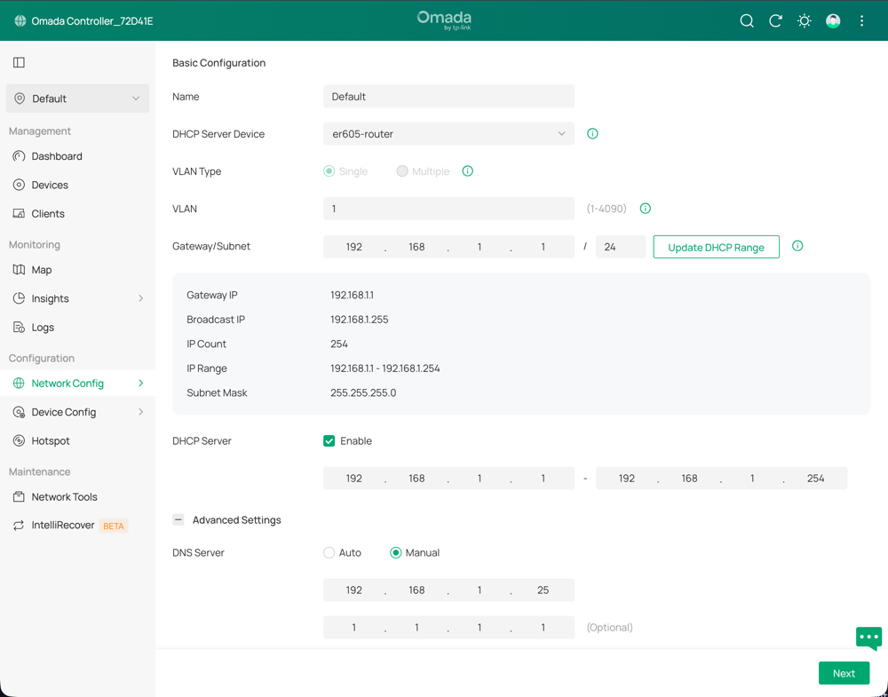

import { Steps } from '@astrojs/starlight/components';

Before your device connects to anything, whether it's a page you visit or ads and trackers running in the background of that page, your device asks your DNS server for the address by name first.
By default, this is handled by your router and ISP.
When Pi-hole is enabled, it answers those requests and if the name is on a blocklist, Pi-hole blocks the lookup and the connection is never made.

Network traffic itself does not flow through the Pi-hole.

Now that you have your Pi-hole configured to block ads and other types of traffic you want to block, you can configure each device's network settings to use the Pi IP as its DNS server, or you can have your router send all DNS requests through the Pi-hole.

## Configure Network-Wide Blocking

Configure your router's DHCP server to hand out the Pi-hole's IP as the DNS server and use Cloudflare as a backup.

Every device that gets its network settings from your router via DHCP will automatically use Pi-hole for DNS, and if the Pi loses power it will fall back to Cloudflare so your network stays online.

In your router's DHCP settings, set:

- **Primary DNS** - your Pi-hole's IP address (for example, `192.168.1.25`)
- **Secondary DNS** - `1.1.1.1` (Cloudflare) as a fallback

This will look different for each router brand.
Look for **DHCP**, **LAN**, or **DNS** settings.

### Set Up Network-Wide Pi-hole on a TP-Link Omada Controller



<Steps>

1. Log in to the Omada controller and select the site's name.
1. In the sidebar, under **Configuration**, select **Network Config** > **LAN**.
1. Select the edit icon for the network that should use Pi-hole.
1. Expand **Advanced Settings**
1. Next to **DHCP Server**, select **☑ Enable** to expand the DHCP options.
1. Next to **DNS Server**, select **Manual** and enter the Pi-hole's IP address in the first box.
1. In the second box, enter `1.1.1.1` to use Cloudflare as a backup DNS server.
1. Select **Next** to save and apply the settings.

</Steps>

After you save the settings, devices need to renew their DHCP lease to pick up the new DNS server.
This happens automatically when the lease expires (typically within 24 hours, depending on your router), or immediately if you disconnect and reconnect Wi-Fi, or restart the device.

For a smart TV, that means a full power cycle from the menu or the old favorite: unplug it, then plug it back in.

**Verify it's working:** On a device that has renewed its lease, open the Pi-hole query log and browse to a few sites - you should see the device's IP appear as a client.

## Optional: Force Devices That Ignore Router DNS to Use the Pi-hole

Some smart devices like Chromecast and Samsung Smart TVs ignore the DNS server your router assigns and use their own hardcoded DNS:

- **Google Chromecast and Google Home** hardcode `8.8.8.8`.
- **Samsung Smart TVs** may use `8.8.8.8` for some services even when a different DNS is assigned.
- **Android and iOS** support encrypted DNS (DNS-over-HTTPS or DNS-over-TLS), which can send queries directly to Google or Cloudflare, bypassing Pi-hole completely.

<Steps>

1. To force traffic from these devices through the Pi-hole, add NAT rules that intercept all outbound DNS on port 53.

   This uses raw iptables because UFW doesn't expose NAT rules.
   The rules operate at different layers and should not cause conflicts.

   Replace `YOUR-PI-IP` with your Pi-hole's actual IP:

   ```shell "YOUR-PI-IP" title="From the Pi"
   sudo iptables -t nat -A PREROUTING -i eth0 -p udp --dport 53 -j DNAT --to YOUR-PI-IP
   sudo iptables -t nat -A PREROUTING -i eth0 -p tcp --dport 53 -j DNAT --to YOUR-PI-IP
   ```

1. To make the rules persist across reboots:

   ```shell title="From the Pi"
   sudo apt install iptables-persistent
   sudo netfilter-persistent save
   ```

1. Verify the rules were added:

   ```shell title="From the Pi"
   sudo iptables -t nat -L PREROUTING --line-numbers
   ```

   You should see two rules with `DNAT` and `to:YOUR-PI-IP` — one for `udp dpt:domain` and one for `tcp dpt:domain`.

</Steps>

To verify a specific device is now routing through Pi-hole, check the query log at `https://pi-hole.local/admin/queries` and filter by that device's IP.
You should see its DNS requests appearing there.

These rules won't catch encrypted DNS (DNS-over-HTTPS) traffic on port 443.
Blocking DoH requires blocking the IP addresses of known DoH providers, which is more aggressive and can break legitimate HTTPS traffic.
