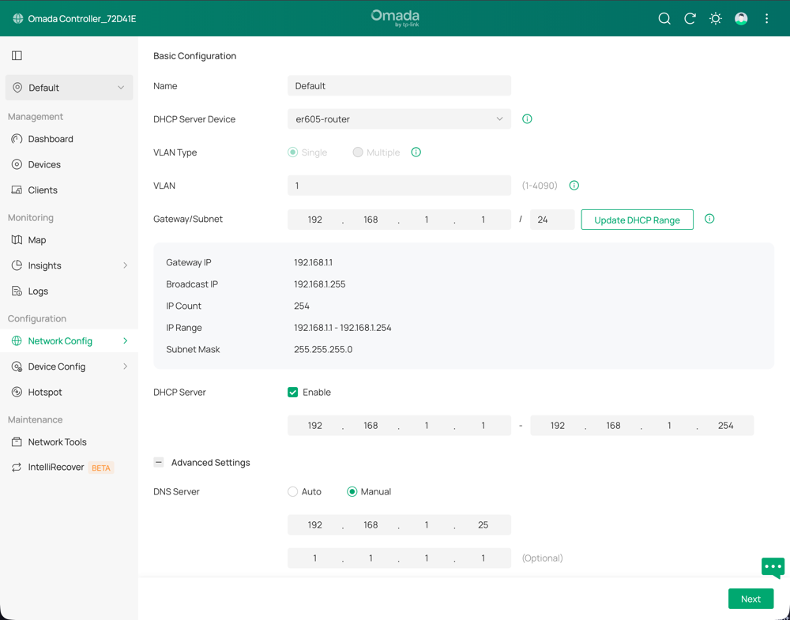

import { Steps } from '@astrojs/starlight/components';
import Verified from '../../../components/Verified.astro';

<Verified date="2026-08" method="tested" />

Before your device connects to anything, whether it's a page you visit or ads and trackers running in the background of that page, your device asks your DNS server for the address by name first.
By default, this is handled by your router and ISP.
When Pi-hole is enabled, it answers those requests and if the name is on a blocklist, Pi-hole blocks the lookup and the connection is never made.

Network traffic itself does not flow through the Pi-hole.

Now that you have your Pi-hole configured to block ads and other types of traffic you want to block, you can configure each device's network settings to use the Pi IP as its DNS server, or you can have your router send all DNS requests through the Pi-hole.

## Configure Network-Wide Blocking

Configure your router's DHCP server to hand out the Pi-hole's IP as the DNS server and use Cloudflare as a backup.

Every device that gets its network settings from your router via DHCP will automatically use Pi-hole for DNS, and if the Pi loses power it will fall back to Cloudflare so your network stays online.

In your router's DHCP settings, set:

- **Primary DNS** - your Pi-hole's IP address (for example, `192.168.1.25`)
- **Secondary DNS** - `1.1.1.1` (Cloudflare) as a fallback

This will look different for each router brand.
Look for **DHCP**, **LAN**, or **DNS** settings.

:::caution[A secondary DNS server is a fallback and a leak at the same time]
Nothing in DNS requires a client to prefer the first server it was handed.

Most Linux clients do try them in order and fall through only on timeout, which behaves like real failover.
Windows, macOS, Android, and a lot of smart-device firmware instead query both or learn to prefer whichever answered fastest, and Cloudflare will usually beat a Raspberry Pi that's busy rebuilding gravity.

The result is that some devices resolve past Pi-hole while it's perfectly healthy.
The symptom is ads reappearing on one device and not another, with nothing in the query log to explain it, because the queries never reached the Pi.

This guide keeps `1.1.1.1` anyway, on the trade that a dead Pi taking the whole house offline is worse than some devices leaking past it.
If you'd rather close the leak, leave **Secondary DNS** empty and set only the Pi-hole.
Then keep [Teleporter backups](/docs/pi-hole/maintenance/#back-up-your-configuration) current, because the Pi becomes a single point of failure for your network's DNS.

If you're chasing intermittent blocking, check this before anything else, and see [Force Devices That Ignore Router DNS to Use the Pi-hole](#optional-force-devices-that-ignore-router-dns-to-use-the-pi-hole) for devices that bypass DHCP entirely.

The resolver behavior described here is drawn from how the implementations document their own selection order, not from measurements on my network.
The rest of this section is tested.
:::

### Set Up Network-Wide Pi-hole on a TP-Link Omada Controller

<Steps>

1. Log in to the Omada controller and select the site's name.
1. In the sidebar, under **Configuration**, select **Network Config** > **LAN**.
1. Select the edit icon for the network that should use Pi-hole.
1. Next to **DHCP Server**, select **☑ Enable** to expand the DHCP options.
1. Expand **Advanced Settings**
1. Next to **DNS Server**, select **Manual** and enter the Pi-hole's IP address in the first box.
1. In the second box, enter `1.1.1.1` to use Cloudflare as a backup DNS server.
1. Select **Save** then **Apply** to save and apply the settings.

</Steps>

After you save the settings, devices need to renew their DHCP lease to pick up the new DNS server.
This happens automatically when the lease expires (typically within 24 hours, depending on your router), or immediately if you disconnect and reconnect Wi-Fi, or restart the device.

For a smart TV, that means a full power cycle from the menu or the old favorite: unplug it, then plug it back in.

**Verify it's working**: On a device that has renewed its lease, open the Pi-hole query log and browse to a few sites - you should see the device's IP appear as a client.

## Optional: Force Devices That Ignore Router DNS to Use the Pi-hole

<Verified date="2026-08" method="tested" />

Some smart devices like Chromecast and Samsung Smart TVs ignore the DNS server your router assigns and use their own hardcoded DNS:

- **Google Chromecast and Google Home** hardcode `8.8.8.8`.
- **Samsung Smart TVs** may use `8.8.8.8` for some services even when a different DNS is assigned.
- **Android and iOS** support encrypted DNS (DNS-over-HTTPS or DNS-over-TLS), which can send queries directly to Google or Cloudflare, bypassing Pi-hole completely.

**This can't be fixed from the Pi itself.**
Network traffic doesn't flow through the Pi-hole (as stated above), so a device's DNS query to `8.8.8.8` never reaches the Pi to intercept in the first place.
Catching it requires a rule on whatever box actually sits between your devices and the internet: your router.

**Blocking the hardcoded address outright doesn't work either.**
Chromecast in particular refuses to function at all if `8.8.8.8` is unreachable, rather than falling back to the DNS server it was assigned.
The fix has to be a transparent redirect that still gives the device a real answer, not a block.

**If your router is a TP-Link Omada Gateway** (not just an Omada-managed switch or access point), it has a feature built for exactly this:

<Steps>

1. In the Omada controller, go to **Device Config** > **DNS**.
1. Select the **DNS Proxy** tab and enable **DNS Proxy**.
1. Under **Proxy Type**, select **DNS Override**.
1. Set **Primary DNS Server** to your Pi-hole's IP address, and optionally a **Secondary DNS Server** as a fallback, such as `1.1.1.1`.
1. Under **Apply Network**, select which networks this applies to.
1. Select **Save**.

</Steps>

This transparently redirects DNS requests bound for any other server to Pi-hole instead, for the networks you selected, with no per-device configuration.
It requires an actual Omada Gateway unit (not all Omada hardware qualifies).
If you don't see a **DNS Proxy** tab under **Device Config**, your hardware or controller version doesn't support it.

Other prosumer-grade routers (OPNsense, pfSense, OpenWrt, and similar) generally offer the same capability under names like "DNS redirect," "transparent DNS proxy," or NAT/policy-routing rules, but the exact steps are specific enough to your router's software that they're out of scope for this guide.

**If none of that is available to you**, the practical options are the ones already covered elsewhere in this guide: accept the device's own ads (as with Roku and Fire TV's captive-portal domains), or put the device in a bypass group so Pi-hole doesn't try to filter it at all - see [Skip Pi-hole for a Specific Device](/docs/pi-hole/block-allow-lists/#skip-pi-hole-for-a-specific-device).

Encrypted DNS (DNS-over-HTTPS or DNS-over-TLS) on Android and iOS is a separate problem: it isn't just hardcoded to one server, it's not plaintext DNS at all, so no redirect at any layer can catch it.
Blocking DoH requires blocking the IP addresses of known DoH providers instead, which is more aggressive and can break legitimate HTTPS traffic.

## Checkpoint

At this point every device on your network uses Pi-hole for DNS, including ones that previously ignored it.

Before you continue, confirm the following:

- A device that renewed its DHCP lease shows up as a client in the Pi-hole query log.
- If you set up DNS Override or an equivalent router-level redirect, a hardcoded-DNS device shows up in the query log too.
- If you run into issues, see [Common Pi-hole Issues](/docs/pi-hole/troubleshooting/#verify-pi-hole-is-working).

The next page covers using Tailscale for remote access and ad blocking away from home.
