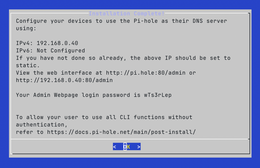

import { Steps } from '@astrojs/starlight/components';

Install Pi-hole and configure it with a secure DNS resolver.

<details>
<summary>If you skipped to this section, expand for setup notes.</summary>

If you installed Pi-hole on an existing device or skipped to this section, these OS-specific things might be different for your setup:

- Installed software like Git, curl, or zsh.
- `apt` package manager - your OS might use a different one.
- The Pi's hostname is `pi-hole` throughout this guide.

</details>

<Steps>

1. SSH to the Pi:

   ```shell title="From your device"
   ssh pi-admin@pi-hole.local
   ```

   Replace `pi-admin` with your username if you chose a different one in Raspberry Pi Imager.

1. Update the system and install dependencies:

   ```shell title="From the Pi"
   sudo apt update && sudo apt upgrade -y
   ```

   This can take 10-20 minutes even on a freshly installed OS.

1. Run the Pi-hole installer:

   ```shell title="From the Pi"
   curl -sSL https://install.pi-hole.net | bash
   ```

1. The installer prompts you with warnings and options. Select:

   - **Static IP Needed**: **Continue**
   - **Upstream DNS Provider**: **Cloudflare** - You can switch to unbound later.
   - **Blocklists**: **Yes** to include the default list.
     We'll change it to a more curated set of lists later.
   - **Enable Logging**: **Yes** - this helps diagnose issues like when streaming apps won't load.
   - **Select a privacy mode for FTL**: **0** - shows which site was blocked on which device. See the [official privacy level docs](https://docs.pi-hole.net/ftldns/privacylevels/) for other options.

   The last screen lists the IP address and a temporary password.
   You'll change the password next, so you can ignore it here.

   

1. Set a permanent password:

   ```shell title="From the Pi"
   sudo pihole setpassword
   ```

1. Open `https://pi-hole.local/admin` in a browser.

   The browser will show a security warning about the security certificate.

   - Chrome: select **Advanced**, then **Proceed to pi-hole.local (unsafe)**.
   - Firefox: select **Advanced**, then **Accept the Risk and Continue**.

   If you don't see the option to proceed, refresh the page.

</Steps>

## Optional: Configure Unbound as Recursive DNS

[Unbound](https://docs.pi-hole.net/guides/dns/unbound/) is a recursive DNS resolver.
Instead of forwarding DNS queries to Cloudflare or your ISP, unbound resolves queries by [walking the DNS tree](https://notes.kodekloud.com/docs/Demystifying-DNS/DNS-as-a-System/Walking-the-DNS-Tree/page) from the root servers.
This means no single upstream provider sees all your DNS queries.

Pi-hole works well with Cloudflare.
Add unbound if you prefer the additional privacy of recursive resolution.

<Steps>

1. Install unbound, then immediately stop it so that you can set your own configuration:

   ```shell title="From the Pi"
   sudo apt install unbound
   sudo systemctl stop unbound
   ```

1. Create the Pi-hole-specific unbound configuration:

   ```ini title="/etc/unbound/unbound.conf.d/pi-hole.conf"
   server:
       verbosity: 0

       interface: 127.0.0.1
       port: 5335

       do-ip4: yes
       do-udp: yes
       do-tcp: yes
       do-ip6: no
       prefer-ip6: no

       # Trust glue only if it is within the server's authority
       harden-glue: yes
       # Require DNSSEC data for trust-anchored zones
       # harden-dnssec-stripped enables DNSSEC validation - unbound rejects responses
       # that fail cryptographic signature checks, protecting against DNS spoofing.
       harden-dnssec-stripped: yes
       # Don't use Capitalization randomization
       use-caps-for-id: no
       # Reduce EDNS reassembly buffer size
       edns-buffer-size: 1232
       # Prefetch close-to-expired cache entries
       prefetch: yes
       # One thread is sufficient for a home network
       num-threads: 1
       # Ensure kernel buffer is large enough
       so-rcvbuf: 1m

       # Ensure privacy of local IP ranges
       private-address: 192.168.0.0/16
       private-address: 169.254.0.0/16
       private-address: 172.16.0.0/12
       private-address: 10.0.0.0/8
       private-address: fd00::/8
       private-address: fe80::/10
   ```

1. Start unbound and verify that it's running on port 5335:

   ```shell title="From the Pi"
   sudo systemctl start unbound
   dig google.com @127.0.0.1 -p 5335 | grep NOERROR
   ```

   You should see a `NOERROR` status and an answer section with an IP address.

1. Point Pi-hole at unbound with Cloudflare as fallback.

   In the Pi-hole web interface, go to **Settings** > **DNS**:

   - In the **Custom DNS servers** field, add `127.0.0.1#5335`.
   - Keep **Cloudflare** checked as a fallback.
   - Select **Save**.

1. Verify Pi-hole is using unbound:

   ```shell title="From the Pi"
   dig google.com @127.0.0.1 | grep NOERROR
   ```

   You should see a `NOERROR` status.
   The first query may be slow as unbound builds its cache.

</Steps>

:::caution["port 53: Address in use"]
If you install unbound and don't stop it right away, it will self-assign port 53 and conflict with the Pi-hole.

The FTL log will show:
`dnsmasq: failed to create listening socket for port 53: Address in use`

To fix: configure unbound on port 5335 as above, then restart both:

```shell title="From the Pi"
sudo systemctl restart unbound
sudo systemctl restart pihole-FTL
```
:::

## Optional: Monitor Pi-hole with Netdata

[Netdata](https://www.netdata.cloud/) is a lightweight real-time monitoring tool with a built-in Pi-hole integration.
It shows query rate, cache hits, blocked domains, and FTL status alongside system metrics such as CPU, memory, temperature, and Fail2Ban statistics.

The Pi-hole web interface already shows DNS stats.
Add Netdata if you want system-level metrics alongside your Pi-hole data.

<Steps>

1. Install Netdata:

   ```shell title="From the Pi"
   curl https://get.netdata.cloud/kickstart.sh > /tmp/netdata-kickstart.sh && sh /tmp/netdata-kickstart.sh --disable-telemetry
   ```

   The installer takes a few minutes.

   When it finishes, Netdata starts automatically and auto-discovers Pi-hole.

1. Allow the dashboard port through UFW if you want access from other devices on your network:

   ```shell title="From the Pi"
   sudo ufw allow 19999/tcp comment 'Netdata dashboard'
   ```

   <details>
   <summary>If you'll only access Netdata over an SSH tunnel</summary>

   ```shell title="From the Pi"
   ssh -L 19999:localhost:19999 pi-admin@pi-hole.local
   ```

   </details>

1. Open the dashboard at `http://pi-hole.local:19999`
   Scroll down to the **Pi-hole** section to see query rate, cache, and blocking stats alongside system metrics.

1. Enable the Fail2Ban collector to see banned IPs per jail.
   This command copies the default configuration.

   After it opens, press <kbd>CTRL+X</kbd> to save it:

   ```shell title="From the Pi"
   sudo /etc/netdata/edit-config go.d/fail2ban.conf
   ```

1. Restart Netdata to apply:

   ```shell title="From the Pi"
   sudo systemctl restart netdata
   ```

   The **Fail2Ban** section will appear in the dashboard showing currently banned IPs and active failures for each jail.

</Steps>

## Checkpoint

At this point Pi-hole is installed and running.

Before you continue to blocklists and allowlists to control what gets blocked, confirm the following:

- Pi-hole web interface loads at `https://pi-hole.local/admin`.
- DNS queries are appearing in the query log.
- The default blocklist is active.
  You can check **Gravity** in the Pi-hole dashboard to confirm.
- If you run into issues, see [Common Pi-hole Issues](./troubleshooting/#pi-hole-installation).
