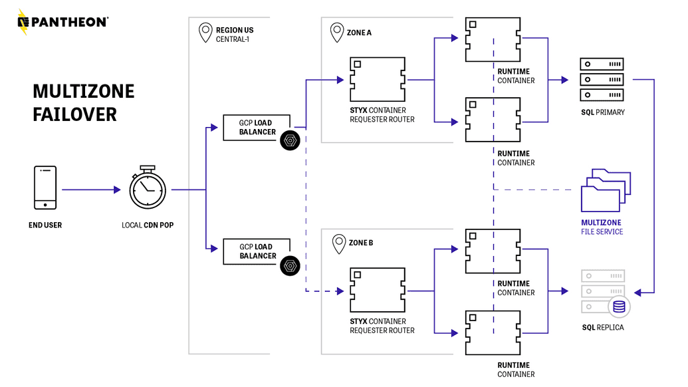

Based on feedback from Support and engineers, I created a draft of this diagram and then worked with Pantheon’s design team to \"commission\" the final product.

Originally available at [Pantheon's Site Multizone Failover](https://docs.pantheon.io/multizone-failover) doc.

Link to PNG: [site-mz-diagram.png](site-mz-diagram.png)
